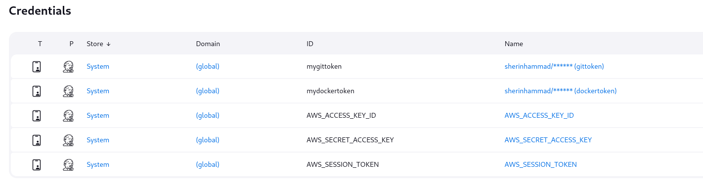

# Terraform + Ansible Automation via Jenkins Pipeline

This repository demonstrates the automation of provisioning and configuring an AWS EC2 instance using a **Jenkins Pipeline**, **Terraform**, and **Ansible**. The process is fully automated and triggered through the Jenkins pipeline.

## Pipeline Functionality

The Jenkins pipeline consists of the following stages:

1. **Terraform Init & Apply**: Initializes and applies the Terraform configuration to provision an EC2 instance on AWS.
2. **Wait**: Pauses for approximately 1 minute to ensure that the EC2 instance is fully booted and ready.
3. **Extract Private Key**: Extracts the private key from the Terraform output and securely saves it with appropriate permissions.
4. **Create Ansible Inventory**: Retrieves the public IP of the EC2 instance and creates an Ansible inventory file for configuration.
5. **Run Ansible Playbook**: Uses the generated inventory and private key to SSH into the EC2 instance and execute the configuration defined in the `playbook.yaml`.

## Repository Structure

```bash
.
├── Jenkinsfile              # Defines the Jenkins pipeline
├── main.tf                  # Terraform configuration for provisioning EC2 instance
├── playbook.yaml            # Ansible playbook for configuring the EC2 instance
└── README.md                # Documentation of the project
```

**AWS Credentials**
The pipeline requires the following AWS credentials to be stored in Jenkins:
- AWS_ACCESS_KEY_ID
- AWS_SECRET_ACCESS_KEY
- AWS_SESSION_TOKEN
  


**Notes**
- The EC2 instance must be associated with a security group that allows SSH access on port 22.
- The SSH host key verification is disabled during the playbook execution by setting ANSIBLE_HOST_KEY_CHECKING=False. This is done to avoid any prompts during SSH access in the automation process.
- The private key is saved to the /tmp/my-key.pem location with the appropriate file permissions (chmod 600).
